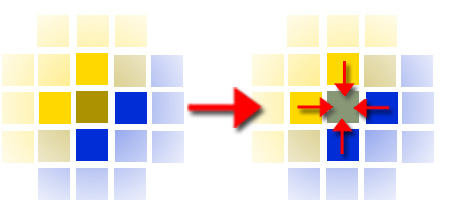
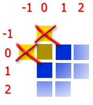

# U16 | Image Processing - Bild spiegeln und weichzeichnen

Bildverarbeitung ist ein wichtiges Thema im Design und der
Computergraphik. Um zu verstehen, wie Programme wie zum Beispiel
Photoshop oder Gimp mit Pixelmanipulation komplette Bilder verändern,
sollen Sie in dieser Aufgabe ein Programm implementieren, dass ein Bild horizontal spiegelt und weichzeichnet.

## Spiegeln

Schreiben Sie dazu eine Methode ```private Image flipImageHorizontal(Image img)```, welche
aus einem Image-Objekt die Pixel-Daten ausliest und anschließend so
umdreht, dass das Bild horizontal gespiegelt und dann als neues
Image-Objekt zurückgegeben wird. Das soll einmal pro Frame geschehen.


## Weichzeichnen

| Bild ohne Blureffekt | Bild mit (mehrfachem) Blureffekt |
|:------:|:------:|
|  |  |

Erweitern Sie ihr Programm um eine
weitere Methode ``` private Image blurImage(Image img)```. Im Gegensatz zum einfachen Spiegeln reicht es hierbei nicht aus, einzelne Pixel zu vertauschen, sondern Sie müssen auch die umliegenden Pixel miteinbeziehen (kontextabhängige Pixelmanipulation).

Um einen Pixel verschwimmen zu lassen, benötigen Sie die
Farbinformationen der Pixel darüber, darunter und rechts und links
daneben. Iterieren Sie in der entsprechenden Methode in einer zweifach
verschachtelten Schleife die Pixel folgendermaßen:
```java
    for (int y = 0; y < sourcePixels.length; y++) {
        for (int x = 0; x < sourcePixels[y].length; y++) {
            // ...
        }
    }
```
Auf diese Weise können Sie die Variablen x und y wie Koordinaten im Bild verwenden (`sourcePixels[y][x-1]`liegt zum Beispiel links neben dem Pixel`sourcePixels[y][x]`.) Um nun Ihr Bild mit einem Blur-Filter zu belegen, benötigen Sie die unveränderten Farbwerte der Pixel um den zu verändernden Pixel herum, deshalb ist es wichtig, sich das ursprüngliche Pixelarray (hier sourcePixels) abzuspeichern und nicht zu verändern, sondern das Ergebnis der Pixelmanipulation in ein neues Pixelarray (hier targetPixels) abzuspeichern.

Für den Punkt an der Stelle y\|x benötigen Sie also Farbwerte der Punkte um diesen Punkt herum, um dann den Durchschnittswert der Farben zu errechnen und somit das Bild etwas verschwimmen zu lassen.



Errechnen Sie nun von allen umliegenden Pixeln (siehe oben) und dem
Pixel selbst aus der entsprechenden Farbe die Durchschnittswerte für
rot, grün und blau und erstellen Sie daraus eine neue Farbe, die Sie
dann folgendermaßen in das `targetPixels `Pixelarray schreiben können:
```java
    Color color = new Color(red, green, blue);
    int result = color.toInt();
    // ...
    targetPixels[y][x] = result;
```
Beachten Sie dabei, dass überprüft werden muss, ob der entsprechende
Pixel überhaupt noch im Bild liegt (bei \[0\]\[0\] liegen die Pixel
links und darüber nicht mehr im Array).


